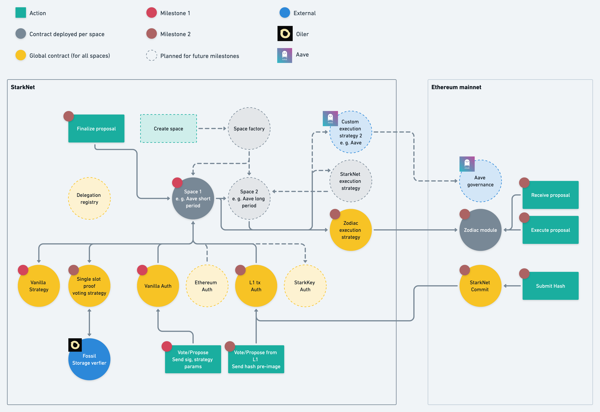
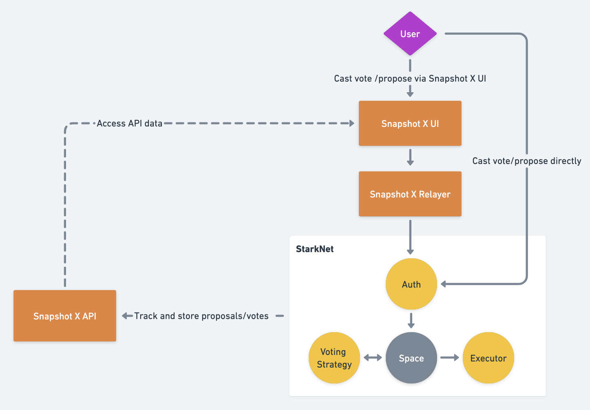

<div align="center">
    
    <h1>Snapshot X</h1>
    <strong>Snapshot X is an on-chain multi-governance client deployed on <a href="https://starkware.co/starknet/">StarkNet</a>.</strong>
</div>
<br>
<div align="center">
    
    <a href="https://github.com/snapshot-labs/snapshot-x/issues?q=is%3Aissue+is%3Aopen+label%3A%22help+wanted%22">
        
    </a>
    <a href="https://telegram.snapshot.org">
        
    </a>
    <a href="https://discord.snapshot.org">
        
    </a>
    <a href="https://twitter.com/SnapshotLabs">
        
    </a>
</div>

## Overview

Governance mechanisms obey a trilemma between **decentralisation**, **cost**, and **flexibility**. On the one hand, you have systems like [Snapshot](https://snapshot.org/#/) that provide a very cheap experience [1] with lots of flexibility. However it relies on one trusting the Snapshot off-chain protocol to deliver the verdict of a particular governance proposal and to not censor votes. Flexibility comes from the wide range of voting strategies than one can employ to calculate the voting power for each user. 

On the other hand, you have governance systems that run fully on-chain on Ethereum mainnet. [Compound Governor](https://github.com/compound-finance/compound-protocol/blob/master/contracts/Governance/GovernorBravoDelegate.sol) is one example of such a system. All the voting logic is computed on-chain which provides an equivalent degree of decentralisation to Ethereum itself. The compromise of such a system is a high cost of participation due to the high gas costs incurred when transacting on the blockchain. The flexibility of the system is also limited by cost as sophisticated voting strategies require increased on-chain logic and therefore it would cost even more and limit participation further to utilise them.

Snapshot X aims to bridge this divide by providing a fully on-chain governance system that is 50-100x cheaper than current solutions that run on Ethereum mainnet. We hope that this will unlock massive increases in on-chain governance participation and flexibility of the governance mechanism without having to make any compromises on decentralisation. This is achieved by running the voting logic on StarkNet, which provides cheap computation whilst inheriting all of the security guarantees of Ethereum itself. Once voting on a proposal has ended, an L1-L2 message bridge can be utilised to allow transactions inside the proposal to be permissionless executed on Ethereum mainnet. 

<p align="center">

</p>


## On Chain Architecture 

Snapshot X is designed to be as modular as possible to provide maximum configurability. As displayed in the diagram below, certain contracts have new instances which are deployed for each DAO (or more specifically per [space](#Space-Contract)) that utilises Snapshot X. Whilst others are treated like library contracts and have a single instance which is shared between all DAOs.



### Space Contract

The [space](contracts/starknet/space/space.cairo) is THE core contract: it's in charge of tracking proposals, votes, and other general settings.
To deploy a new space, you will need to provide:
- `voting_delay`: The delay between when a proposal is created, and when the voting starts. A `voting_delay` of 0 means that as soon as the proposal is created, anyone can vote. A `voting_delay` of 3600 means that voting will start `3600` seconds after the proposal is created.
- `voting_duration`: The duration of the voting period, i.e. how long people will be able to vote for a proposal.
- `proposal_threshold`: The minimum amount of voting power needed to be able to create a new proposal in the space. Used to avoid having anyone be able to create a proposal.
- `voting_strategies`: A list of voting strategy contracts addresses that define the voting strategies used by the space. The voting power of each user will be calculated as the sum of voting powers returned for each strategy in the list for that user. More information in the [Voting Strategy](#Voting-Strategies) section.
- `authenticators`: A list of accepted authenticators. These are the ways in which a user can authenticate themselves in order to vote or propose. For more information, refer to the [Authenticators](#Authenticators) section.
- `executor`: The execution strategy contract that will handle the execution of transactions inside proposals once voting is complete. More information about execution in the [Execution Contract](#Execution-Contract) section.

Once a space has been created, users can create new proposals by calling the `propose` method (provided the caller has at least `proposal_threshold` voting power). Users don't directly interact with the `space` contract, but instead via one of the `authenticator` contracts that act as proxies. 

The proposal creator will need to provide the following parameters:
- `proposer_address`: The Ethereum address of the proposal creator which will be used to check that their voting power exceeds the `proposal_threshold`.
- `metadata_uri`: Pointer to the location of the metadata for the proposal that the proposal creator should upload.
- `execution_hash`: Hash of all of the transactions inside the proposal.
- `execution_params`: Additional parameters required by the execution strategy.
- `ethereum_block_number`: The Ethereum block number at which point the snapshot of voting power is taken.  
- `voting_strategy_params`: The parameters required by the voting strategies used by the space. 

Once a proposal has been created, and the `voting_delay` has elapsed, users can then vote for the proposal (once again, using an `authenticator` as a proxy). 

Voters will need provide the following parameters:
- `proposal_id`: The ID of the proposal in the space they want to vote in.
- `voter_address`: The Ethereum address of the proposal creator which will be used to calculate their voting power.
- `choice`: The votes choice; `FOR`, `AGAINST`, or `ABSTAIN`. 
-  `voting_strategy_params`: The parameters required by the voting strategies used by the space. 

Once the `voting_duration` has passed, votes are closed, and anyone can call `finalize_proposal` (this time directly on the space contract as no authentication is required): this will finalize the proposal, count the votes for/against/abstain, and call the `executor`. 

Note that each DAO will have at least one space, however a DAO might choose to have multiple spaces if they want to create different 'categories' of proposal each with different settings.

### Voting Strategies

Voting strategies are the contracts used to determine the voting power of a user. Voting strategies can be created in a permissionless way however to use one, one must whitelist the strategy contract in the relevant space contract for the DAO. The most common example is using the ERC-20 token balance of a user to determine his voting power. But we could imagine other voting strategies: owning a specific NFT, owning NFT of collection X and another NFT of collection Y, having participated in protocol xyz... the possibilities are endless! [2] We provide the [single_slot_proof strategy](contracts/starknet/strategies/single_slot_proof.cairo) which allows classic ERC20 and ERC721 balances on L1 (thanks to [Fossil](#Fossil-Storage-Verifier)) to be used as voting power, but feel free to create your own strategies! We hope that the flexibility of the system will unlock a new era of programmable on-chain governance. The interface of a strategy can be found [here](contracts/starknet/strategies/interface.cairo). 

### Fossil Storage Verifier

The backbone of the voting strategies is the Fossil module built by the awesome Oiler team. This module allows any part of the Ethereum mainnet state to be trustlessly verified on StarkNet. Verification of Ethereum state information is achieved by submitting a proof of the state to StarkNet and then verifying that proof. Once this state information has been proved, we can then calculate voting power as an arbitrary function of the information. For more information on Fossil, refer to their [Github](https://github.com/OilerNetwork/fossil)

### Authenticators

Authenticators are the contracts in charge of authenticating users. All authenticators have a function titled `execute` that takes the following arguments: 
- `to`: The address of the space contract the user wants to interact with. 
- `function selector`: The function selector for the function inside the space contract that the user wants to invoke (vote or propose).
- `calldata`: An array of parameters that are required by the function specified by `function selector`. 

Beyond this, each authenticator implements different logic depending on the type of authentication that is being done. This repository provides three useful authenticators:
- [Ethereum Signature Authenticator](contracts/starknet/authenticator/ethereum.cairo): Will authenticate a user based on a message signed by Ethereum private keys.
- [StarkNet Signature Authenticator](contracts/starknet/authenticator/starknet.cairo): Will authenticate a user based on a message signed by StarkNet private keys.
- [Ethereum Transaction Authenticator](contracts/starknet/authenticator/l1_tx.cairo): Will authenticate a user via getting them to submit a transaction on Ethereum and checking that the sender address is valid.  Specifically, the user will call the commit method of the [StarkNet Commit](contracts/ethereum/L1Interact/StarkNetCommit.sol) L1 contract with a hash of their desired `to`, `function_selector`, and `calldata`. This hash along with the user's Ethereum address will then be sent to the Ethereum Transaction Authenticator by the StarkNet message bridge and will be stored there. The user then submits the hash preimage to the `execute` method of the authenticator and the hash will be computed and checked against the one stored. If the hashes match and the sender address stored corresponds to the address in the `calldata`, then authentication was successful. The core use case for this is to allow smart contract accounts such as multi-sigs to use Snapshot X as they have no way to generate a signature and therefore cannot authenticate via signature verification.

Upon successful authentication of the user, the `execute` method will call the function specified by `function selector` in the space contract `to`, with `calldata` as arguments. 

This modularity allows spaces to authenticate users using other authentication methods: For example if you wanted to use Solana keys to authenticate users, you would simply need to write the authenticator contract on Starknet, whitelist it in your space, and Solana users would be able to vote in your DAO!

### Execution

The `executor` contract implements the execution strategy that gets called when voting for a proposal is done. The interface can be found [here](contracts/starknet/execution/interface.cairo). 
Once voting has ended, calling `finalize_proposal` in the space contract will pass the following parameters to the `execute` method of the `executor`:
- `has_passed`: Whether the proposal has passed or not (majority of voting power allocated to `FOR` signifies that the proposal has passed).
- `execution_hash`: Hash of the transactions to be executed.
- `execution_params`: Array of additional parameters that are needed by the execution strategy. 

Currently this repo provides the Zodiac Execution Strategy. This enables a DAO perform permissionless execution of L1 Gnosis Safe transactions upon the successful completion of a proposal. The [Zodiac Relayer](contracts/starknet/execution/zodiac_relayer.cairo`) contract is the `executor` for this strategy, which will forward the execution to the [L1 Zodiac module](contracts/ethereum/SnapshotXZodiacModule/SnapshotXL1Executor.sol) address specified in `executions_params[0]`. To use this strategy, DAOs will need a Gnosis Safe with the Snapshot X Zodiac module activated. 

We will also be adding a StarkNet transaction execution strategy in the near future. 

### Space Factory 

To enable an easy way to deploy and keep track of spaces, each DAO will have a space factory contract that will do this. The factory pattern has not yet been released on StarkNet therefore we are waiting to implement this feature.  


## Off Chain Architecture 

We will now briefly provide an overview of the off-chain aspects of Snapshot X and how they will interact with the on-chain code. 

<p align="center">

</p>

### Snapshot X UI

The [UI](https://github.com/snapshot-labs/sx-ui) provides a simple interface for users to interact with Snapshot X. This will guide users through deploying spaces, creating proposals, and voting. It will also access data from the API and act as a DAO governance dashboard. In future we plan to fully integrate the UI into the existing Snapshot UI to provide a seamless experience between the various governance options offered by Snapshot Labs. 

### Snapshot X Relayer

The [Relayer](https://github.com/snapshot-labs/sx-ui) will submit transactions received by the UI to StarkNet. We will have a mechanism that will allow DAOs to fund the transactions the relayer submits so that there is a zero cost user experience. However importantly, users can directly interact with Snapshot X and therefore do not rely on trusting the relayer to not censor votes. In future we also plan to decentralise the relayer, allowing anyone to run one, further reducing the trust assumptions of using it.  

### Snapshot X API 

The [API](https://github.com/snapshot-labs/sx-api) indexes Snapshot X data. Specifically, it monitors events emitted by spaces and space factories so that votes, proposals, and the deployment of new spaces can be tracked.   


[1] Despite being off-chain, there are some costs associated with running the infrastructure. These costs are sufficiently low that it is possible for them to be fully subsidised by Snapshot Labs, providing a zero cost user experience.

[2] We are big fans of the concept of 'turing-complete' governance and it is the standard we are striving for with Snapshot X. See [this](https://baby.mirror.xyz/O7a922A-9zT4C4UwssRExkftdHywJ-13sR2rxQ-t__k) article for more information. 

## Usage

### Clone repository:

```bash 
git clone https://github.com/snapshot-labs/sx-core.git
git submodule update --init --recursive
```
Note: The submodule included in the repo is the [Fossil](https://github.com/OilerNetwork/fossil) Storage Verifier

### Install Python and Yarn requirements: 

```bash
python3.7 -m venv ~/cairo_venv
source ~/cairo_venv/bin/activate
pip3 install -r requirements.txt
yarn
```

### Compile all contracts:

```bash
yarn compile
# You can also use yarn compile:l1 to just compile solidity contracts
# or yarn compile:l2 to just compile cairo contracts
```

### Testing

Tests are separated into three categories:

- Ethereum tests in `tests/ethereum`: Tests for our solidity contracts
- Starknet tests in `tests/starknet`: Tests for our cairo contracts
- Cross chain tests in `tests/crosschain`: Tests that will cover interaction between solidity and cairo contracts.

To run these tests locally: 

#### Install and run [StarkNet Devnet](https://github.com/Shard-Labs/starknet-devnet) (In a separate terminal):
```bash
pip install starknet-devnet
starknet-devnet -p 8000
```

#### Run an ethereum hardhat node (In a separate terminal)

```bash
npx hardhat node
```

#### Run tests:
```bash
yarn test
# You can also use `yarn test:l1` to just test the solidity contracts,
# `yarn test:l2` to just test the cairo contracts,
# and `yarn test:l1l2` to test the cross chain flow
```

## DISCLAIMER: STILL IN DEVELOPMENT

This project is still under heavy development. Feel free to contact us on [Discord](https://discord.snapshot.org)!

## License

Snapshot is open-source software licensed under the © [MIT license](LICENSE).

