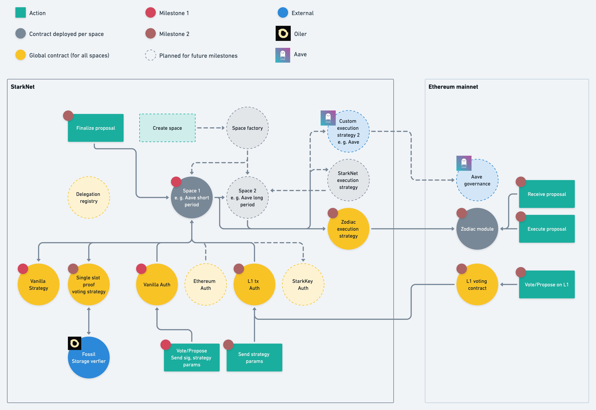

# Milestone 2

The second milestone builds on milestone 1 by including a single slot proof voting strategy, an execution strategy utilizing a Zodiac module on L1, and finally an L1 voting contract and a corresponding auth contract on L2. Additionally, we update the space contract to take an array of voting and auth strategies rather than just a single option for each. 

[Source](https://whimsical.com/snapshot-x-milestone-2-7UJARrFFC3LbnZexGEtQQB)

(The standard strategy that will enable voting power to be found via the balances of erc20 and erc721 tokens)
